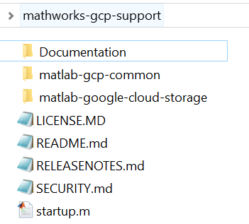

# MATLAB® Interface *for Google Cloud Storage™*

This is a MATLAB® interface for the Google Cloud Storage™ services

## Requirements
### MathWorks products
* Requires MATLAB release R2017b or later.
* Google Cloud Common Utilities found at https://github.com/mathworks-ref-arch/matlab-gcp-common

### 3rd party products
* Google Cloud Platform Services account

To build a required JAR file:
* Maven™ 
* JDK 8+

## Getting Started
Please refer to the [Documentation](Documentation/README.md) to get started.
The [Installation Instructions](Documentation/Installation.md) and [Getting Started](Documentation/GettingStarted.md) documents provide detailed instructions on setting up and using the interface.

The easiest way to fetch this repo and all required dependencies is to clone the top-level repository using:

```bash
git clone --recursive https://github.com/mathworks-ref-arch/mathworks-gcp-support.git
```

This is what your top level directory<sup>1</sup> should look like:



### Build the google-cloud-storage SDK for Java components
The MATLAB code uses a single JAVA SDK for all matlab interfaces for google cloud which can be built using:
```bash
cd mathworks-gcp-support/matlab-gcp-common/Software/Java
mvn clean package
```

Once built, use the ```mathworks-gcp-support/matlab-google-cloud-storage/Software/MATLAB/startup.m``` function to initialize the interface.
```MATLAB
cd('mathworks-gcp-support/matlab-google-cloud-storage/Software/MATLAB')
startup
```

For obtaining credentials and ```setting up authentication``` refer [Authentication](Documentation/Authentication.md)

For an end to end example refer ```Software/MATLAB/scripts/Examples```

### Quickstart

This is a quickstart for using the interface to google-cloud-storage, to perform steps such as creating, listing, deleting Buckets and Blob objects on Google cloud Storage.
More detailed examples can be found in [BasicUsage](Documentation/BasicUsage.md)

```
% Create the google cloud storage client

storage = gcp.storage.Storage()

storage =

  Storage with properties:

    projectId: 'pfxxxxxloy'
       Handle: [1x1 com.google.cloud.storage.StorageImpl]

% Create a bucket. Note: Google Cloud Storage provides naming guidelines

bucketName = 'com-myorg-mybucket';
bucketInfo = gcp.storage.BucketInfo.of(bucketName);
bucketTargetOption = gcp.storage.Storage.BucketTargetOption.userProject(storage.projectId);
bucket = storage.create(bucketInfo, bucketTargetOption)

bucket =

  Bucket with properties:

     projectId: "pftxxxxxoy"
    bucketName: "com-myorg-mybucket"
        Handle: [1x1 com.google.cloud.storage.Bucket]

% List Buckets with single or multiple BucketListOptions as filters

% Example of existing buckets to list from:
%
%        BucketName              Createtime                      Owner            
%    __________________    ______________________    _____________________________
%
%    "mymattestbucket1"    "07-Feb-2020 17:07:37"    "project-owners-46REDACTED89"
%    "newmattestbucket1"   "07-Feb-2020 19:07:37"    "project-owners-46REDACTED89"
%    "xymattestbucket1"    "07-Feb-2020 21:07:37"    "project-owners-46REDACTED89"

bucketListOption1 = gcp.storage.Storage.BucketListOption.userProject(storage.projectId);
bucketList = storage.list(bucketListOption1)

bucketList =

  1x3 cell array

    {1x1 gcp.storage.Bucket}    {1x1 gcp.storage.Bucket}    {1x1 gcp.storage.Bucket}

bucketListOption2 = gcp.storage.Storage.BucketListOption.prefix("my");
bucketList = storage.list(bucketListOption1,bucketListOption2)

bucketList =

  1x1 cell array

    {1x1 gcp.storage.Bucket}

% Create Blob object within Bucket

x = magic(4);
blob = bucket.create("unique_blobName",x)

blob =

  Blob with properties:

         name: "unique_blobName.mat"
    projectId: "pftxxxxloy"
       Handle: [1x1 com.google.cloud.storage.Blob]

% List Blobs within Bucket with single or multiple BlobListOptions as Filters

% Example of Blobs to list from
%
%        blobName               bucketName              Createtime                                    Owner                          
%    _____________________    __________________    ______________________    _________________________________________________________
%
%    "unique_blobName.mat"    "mymattestbucket1"    "07-Feb-2020 17:07:38"    "user-46xxxxxxx89-compute@developer.gserviceaccount.com"
%    "image_blobName.mat"     "mymattestbucket1"    "07-Feb-2020 19:07:38"    "user-46xxxxxxx89-compute@developer.gserviceaccount.com"

blobListOption1 = gcp.storage.Storage.BlobListOption.userProject(storage.projectId);
blobs = storage.list( bucket.bucketName ,blobListOption1)

blobs =

    1x2 cell array

    {1x1 gcp.storage.Blob}  {1x1 gcp.storage.Blob}

blobListOption2 = gcp.storage.Storage.BlobListOption.prefix("un");
blobs = storage.list( bucket.bucketName ,blobListOption1,blobListOption2)

blobs =

    1x1 cell array

    {1x1 gcp.storage.Blob}

% Deleting the bucket and shutting down the client
% Bucket needs to be empty before being deleted

% Delete Blob Object

blobSourceOption = gcp.storage.Blob.BlobSourceOption.generationMatch;
blob.delete(blobSourceOption)

ans =

  logical

   1

% Delete empty Bucket

bucketSourceOption = gcp.storage.Bucket.BucketSourceOption.metagenerationMatch;
bucket.delete(bucketSourceOption)
ans =

  logical

   1
```

You can also use ```gsutil Tool``` from MATLAB command prompt. See [Documentation for gsutil usage](Documentation/gsutil.md)

## Logging
When getting started or debugging it can be helpful to get more feedback. Once the Client has been created one can set the logging level to verbose as follows:
```
logObj = Logger.getLogger();
logObj.DisplayLevel = 'verbose';
```
See: [Logging](Documentation/Logging.md) for more details.
## License
The license for the MATLAB Interface *for Google Cloud Storage* is available in the [LICENSE.md](LICENSE.md) file in this GitHub repository. This package uses certain third-party content which is licensed under separate license agreements. See the [pom.xml](https://github.com/mathworks-ref-arch/matlab-gcp-common/blob/master/Software/Java/pom.xml) file for third-party software downloaded at build time.

## Enhancement Request
Provide suggestions for additional features or capabilities using the following link:   
https://www.mathworks.com/products/reference-architectures/request-new-reference-architectures.html

## Support
Email: `mwlab@mathworks.com` or please log an issue.

## Notes:

<sup>1</sup> Used with permission from Microsoft.   

[//]: #  (Copyright 2020 The MathWorks, Inc.)
